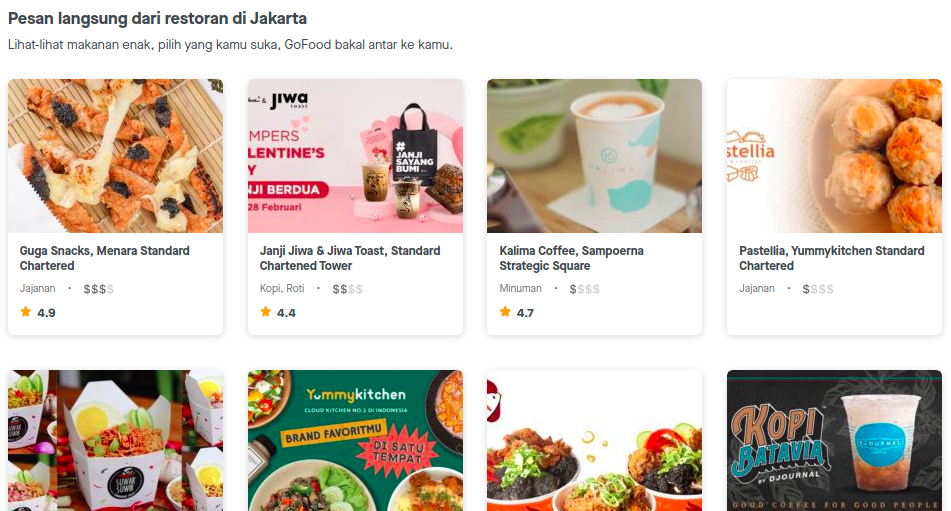
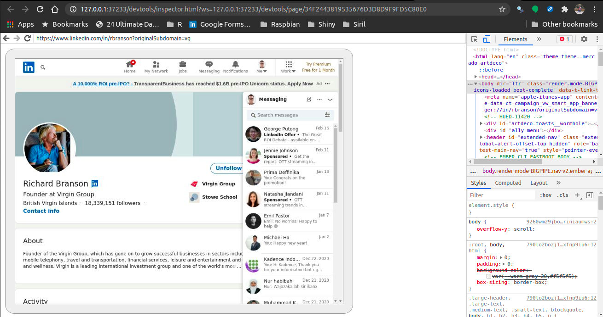

```{r setup, include=FALSE}
knitr::opts_chunk$set(echo = TRUE)
setwd("~/Documents/ikanx101/_posts/web scraping/post 2 chromote dan rvest")
library(dplyr)
```

Pada [tulisan sebelumnya](https://ikanx101.com/blog/webscrape-tutorial/) saya telah memberikan penjelasan mengenai bagaimana _web scrape_ dilakukan dengan cara _parsing html_ dengan `ralger` dan membaca `.json` dari _API web_ dengan `jsonlite`.

Sekarang saya akan memberikan tutorial web scraping dengan `library(rvest)` dan `library(chromote)`.

Kedua _libraries_ ini adalah andalan saya untuk melakukan _web scraping_ ke situs yang relatif sulit di-_scrape_. Kenapa?

1. `rvest`
    - Performanya cepat.
    - Bisa diubah _user agent_-nya ke _browser_ lainnya.
1. `chromote` bertindak sebagai _mimicking_ Google Chrome.

---

# Tutorial `library(rvest)`

Cara kerja `library(rvest)` adalah dengan _parsing html_. Mirip seperti [`library(ralger)`](https://ikanx101.com/blog/webscrape-tutorial/#tutorial-parsing-html), yakni menargetkan `css object` dalam suatu _page website_.

Secara _default_, baik `rvest` dan `ralger` menggunakan `libcurl` atau `r-curl` sebagai _user agent_.

Cara mengeceknya:

```{r,message=FALSE,warning=FALSE}
library(rvest)
se <- html_session( "https://httpbin.org/user-agent" )
se$response$request$options$useragent
```

Kadangkala beberapa situs mem-_block_ _user agent_ ini. Oleh karena itu, kita perlu mengubahnya terlebih dahulu.

Pertama-tama, saya akan berikan contoh cara _web scraping_ dengan `rvest` tanpa mengubah _user agent_.

## _Web scraping_ dengan _User Agent Default_ 

### Contoh I: GOFOOD

Misalkan saya hendak _web scraping_ halaman depan dari [_Gofood_](https://gofood.co.id/jakarta/restaurants) berikut ini:

```{r,echo=FALSE,fig.align='center'}

```

Saya akan mengambil informasi nama restoran dan jenis restorannya.

Menggunakan _css selector_, saya mendapatkan `css object` yang akan saya ambil sebagai berikut:

1. Nama restoran: `.m-0.font-maison-bold`
1. Jenis restoran: `.cusineTextButler`

Saya akan melakukan _scraping_ dengan cara membuat dua _vectors_ (atau _arrays_) per data yang mau saya ambil lalu kemudian kedua _vectors_ tersebut saya gabung menjadi satu _dataframe_.

```{r,warning=FALSE,message=FALSE}
url = "https://gofood.co.id/jakarta/restaurants"
nama_restoran = 
  read_html(url) %>% 
  html_nodes(".m-0.font-maison-bold") %>% 
  html_text()
jenis_restoran = 
  read_html(url) %>% 
  html_nodes(".cusineTextButler") %>% 
  html_text()
knitr::kable(data.frame(nama_restoran,jenis_restoran))
```

### Contoh II: Cookpad

Contoh berikutnya misalkan saya hendak mengambil bahan-bahan yang digunakan untuk memasak tongseng kambing yang ada di situs _cookpad_ [berikut ini](https://cookpad.com/id/resep/13602209-tongseng-kambing).

Saya akan mengambil tiga data, yakni:

1. Judul masakan dengan __css__:`.field-group--no-container-xs`.
1. User atau _author_ dari resep ini dengan __css__: `.truncate`.
1. Bahan masakah dengan __css__: `.border-dashed div`.

Berbeda dengan contoh pertama, saya akan langsung buat data hasil _scraping_ saya berbentuk _dataframe_.

```{r,warning=FALSE,message=FALSE}
url = "https://cookpad.com/id/resep/13602209-tongseng-kambing"
data = 
  read_html(url) %>% {
  tibble(
    judul_masakan = html_nodes(.,".field-group--no-container-xs") %>% html_text(),
    author = html_nodes(.,".truncate") %>% html_text(),
    bahan_masakan = html_nodes(.,".border-dashed div") %>% html_text()
  )
} 

```


```{r,include=FALSE}
data = 
  data %>% 
  mutate(bahan_masakan = stringr::str_trim(bahan_masakan),
         judul_masakan = stringr::str_trim(judul_masakan),
         author = stringr::str_trim(author)
         )
```

```{r}
knitr::kable(data)
```

## Mengubah _User Agent_ `rvest` 

Sekarang saya akan menginformasikan bagaimana caranya mengubah _user agent_ di `rvest`. Caranya adalah dengan memanfaatkan `library(httr)` dan menggunakan _function_ `user_agent()` untuk mengubah _default value_ `rvest` ke _browser_ lain.

Sebagai contoh, saya akan mengubah _user agent_ menjadi `Chrome/54.0.2840.71`.

```{r}
uastring <- "Chrome/54.0.2840.71"
se <- html_session("https://httpbin.org/user-agent",httr::user_agent(uastring))
se$response$request$options$useragent
```

Apa sih manfaatnya? 

> Dengan mengubah _user agent_ kita bisa mengakses situs yang dijaga oleh `robot.txt` karena mereka biasanya memblokir _user agent_ `libcurl` atau `curl`.


# Tutorial `library(chromote)`

`chromote` memberikan sensasi mirip dengan `RSelenium`, yakni bekerja dengan cara _mimicking_ _browser_. Sesuai namanya, `chromote` merupakan _library_ untuk melakukan otomasi di _Google Chrome_ namun kita bisa memanfaatkannya untuk melakukan _web scraping_ dengan menuliskan __sedikit__ `javascript` dalam algoritmanya.

## _Web Scraping_ __Linkedin__

Kali ini saya akan mencoba _web scraping_ data dari _Linkedin_. Sebagai contoh, saya akan mengambil data yang simpel-simpel saja, yakni profil dari [__Sir Richard Branson__](https://www.linkedin.com/in/rbranson/) di akun _Linkedin_-nya.

```{r,include=FALSE}
load("blog.rda")
```

Cara kerja `chromote` adalah dengan membuka _tab_ _devtools_ di __Google Chrome__ sebagai berikut:

```{r}
library(chromote)

url = "https://www.linkedin.com/in/rbranson/"

#b <- ChromoteSession$new()
#b$Network$setUserAgentOverride(userAgent = "Chrome Ikanx")
#b$view()
#cookies <- b$Network$getCookies()
#b$Network$setCookies(cookies = cookies$cookies)
#b$Page$navigate(url)
```

Sehingga akan muncul seperti ini:

```{r,echo=FALSE,fig.align='center'}

```

Untuk melakukan _web scraping_, saya tetap menggunakan _css selector_ untuk mendapatkan `css object` yang kemudian saya masukkan ke dalam `javascript` seperti ini:

```{r}
#x = b$Runtime$evaluate('document.querySelector(".t-24").innerText')
#nama = x$result$value
nama
#x = b$Runtime$evaluate('document.querySelector(".inline-block+ .t-normal").innerText')
#follower = x$result$value
follower
#x = b$Runtime$evaluate('document.querySelector(".t-18").innerText')
#job = x$result$value
job
```

Bagaimana? _Any comments?_

---

`if you find this article helpful, support this blog by clicking the
ads.`