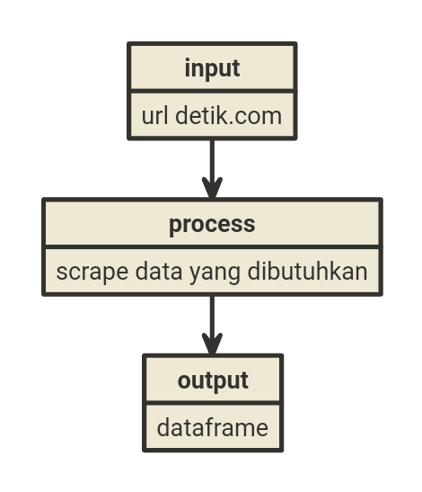

```{r setup, include=FALSE}
knitr::opts_chunk$set(echo = TRUE)
rm(list=ls())
```

_Weekend_ kemarin, sebelum saya tahu [saya positif COVID](https://ikanx101.com/blog/pos-covid/). Salah seorang pembaca _blog_ saya ini menghubungi saya untuk menanyakan bagaimana cara melakukan _web scraping_ situs [detik.com](https://www.detik.com/).

Tujuan dia simpel, bagaimana mengambil data:

1. Judul atau _headline_,
1. Tanggal berita di-_publish_,
1. Isi berita.

> Bagaimana caranya?

Begini caranya:

---

## Langkah I

Kita panggil terlebih dahulu _libraries_-nya, yakni:

1. `rvest` untuk _web scraping_.
1. `dplyr` untuk _data carpentry_.
1. `stringr` untuk _cleaning_ data berupa teks.

Kita panggil _libraries_-nya di __R__ sebagai berikut:

```{r,warning=FALSE,message=FALSE}
library(rvest)
library(dplyr)
library(stringr)
```

## Langkah II 

Langkah berikutnya adalah membuat _custom function_ yang berfungsi untuk mengambil data yang diinginkan.

_Input_ dari _custom function_ ini adalah sebuah _url_. _Output_-nya adalah sebuah _data frame_.

```{r,echo=FALSE,fig.align='center'}

```

Saya ambil satu contoh _url_ berita terlebih dahulu. Jika saya berhasil membuat _function_ untuk melakukan _scrape_, berarti saya akan bisa melakukannya untuk semua _url_ yang ada.

```{r}
url = "https://finance.detik.com/berita-ekonomi-bisnis/d-5641707/menkes-jamin-vaksin-berbayar-bukan-dari-hibah?tag_from=news_mostpop"
```

## Langkah III

Sekarang adalah proses membuat _function_-nya, setidaknya ada tiga komponen data yang harus di-_scrape_ sesuai dengan tujuan awal. Untuk itu, saya akan membuat satu-persatu _function_ lalu menggabungkannya.

Prosesnya sebenarnya cukup mudah jika kita menggunakan `library(rvest)`, yakni dengan menargetkan `css object` dari elemen yang hendak kita ambil dari suatu _web_.

### Mengambil Judul / _Headline_ Berita

Elemen pertama yang hendak kita ambil adalah judul atau _headline_ berita. Dengan mudah, kita bisa mendapatkan `css object`-nya adalah `.detail__title`.

Berikut adalah _function_-nya:

```{r}
url %>% 
  read_html() %>% 
  html_nodes(.,".detail__title") %>% 
  html_text() 
```

Untuk membereskan teks yang masih amburadul di atas, cukup dengan memanfaatkan _function_ `str_squish()` dari `library(stringr)` berikut:

```{r}
url %>% 
  read_html() %>% 
  html_nodes(.,".detail__title") %>% 
  html_text() %>% 
  str_squish()
```

### Mengambil Tanggal Berita

Elemen kedua yang hendak kita ambil adalah tanggal berita. Dengan mudah, kita bisa mendapatkan `css object`-nya adalah `.detail__date`.

Berikut adalah _function_-nya:

```{r}
url %>% 
  read_html() %>% 
  html_nodes(.,".detail__date") %>% 
  html_text() 
```

Teks di atas sudah cukup rapi.

### Mengambil Isi Berita

Elemen terakhir yang hendak kita ambil adalah isi berita. `css object`-nya adalah `p`.

Berikut adalah _function_-nya:

```{r}
url %>% 
  read_html() %>% 
  html_nodes(.,"p") %>% 
  html_text() 
```

Untuk membereskan teks yang masih amburadul di atas, kita akan gunakan kembali _function_ `str_squish()` dari `library(stringr)`. Selain itu, kita akan gabung teks di atas menjadi satu kesatuan dengan _function_ `paste()` berikut:

```{r}
url %>% 
  read_html() %>% 
  html_nodes(.,"p") %>% 
  html_text() %>% 
  str_squish() %>% 
  paste(collapse = " ")
```

---

## Menggabungkan _Functions_

Dari ketiga _function_ di atas, saya akan membuat satu _function_ gabungan. Tujuannya adalah agar pembacaan `read_html()` dilakukan sekali saja agar efisien. Yakni:

```{r}
scrape_detik = function(url){
  data = 
    url %>% 
    read_html() %>% 
    {tibble(
        headline = html_nodes(.,".detail__title") %>% 
                   html_text() %>% 
                   str_squish(),
        tanggal = html_nodes(.,".detail__date") %>% 
                  html_text(),
        teks = html_nodes(.,"p") %>% 
               html_text() %>% 
               str_squish() %>% 
               paste(collapse = " ")
  )}
  return(data)
}

```

Sekarang saatnya menguji _function_ di atas:

```
scrape_detik(url)
```

```{r,echo=FALSE}
scrape_detik(url) %>% knitr::kable(align = "c")
```

---

Bagaimana? Gampang kan?

`if you find this article helpful, support this blog by clicking the ads.`


