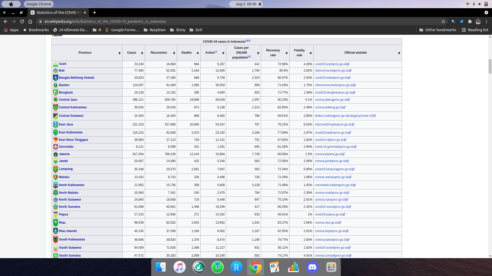

```{r setup, include=FALSE}
knitr::opts_chunk$set(echo = TRUE)

setwd("~/ikanx101 BLOG/_posts/web scraping/post wikipedia")

rm(list=ls())
library(dplyr)
library(rvest)
```

Bagi kebanyakan orang, [Wikipedia](https://en.wikipedia.org/wiki/Main_Page) adalah sebuah anugerah. Bagaimana konsep _open source_ bisa diterapkan dalam ilmu pengetahuan. Setiap orang bisa menuliskan artikel dan keilmuannya secara bebas dan bertanggung jawab di sana. Namun, beberapa institusi pendidikan melarang penggunaan __Wikipedia__ sebagai sumber sitasi penelitiannya.

---

Sebagai salah satu sumber informasi yang aktual, terpercaya, dan bisa divalidasi, bagi saya __Wikipedia__ adalah salah satu sumber data termudah di internet yang bisa saya _web scrape_. Apalagi jika bentuknya berupa tabel.

Sebagai contoh saya akan coba melakukan _web scrape_ dari halaman Wikipedia tentang data Covid 19 di Indonesia [berikut ini](https://en.wikipedia.org/wiki/Statistics_of_the_COVID-19_pandemic_in_Indonesia).

```{r,echo=FALSE,fig.align='center',fig.cap="Contoh Salah Satu Tabel dari Situs Wikipedia"}

```

Tabel di atas adalah satu dari beberapa tabel data yang ada dari halaman tersebut.

Mari saya tunjukkan caranya melakukan _web scrape_ tabel seperti ini:

## Langkah I
Siapkan _url_ dari Wikipedia tersebut: 

```{r}
url = "https://en.wikipedia.org/wiki/Statistics_of_the_COVID-19_pandemic_in_Indonesia"
```

## Langkah II
Kita akan ambil semua tabel yang ada di halaman tersebut dengan _function_ `html_table()` dari `library(rvest)`. Tambahkan parameter `fill = T` pada _function_ tersebut.

```{r}
hasil = url %>% read_html() %>% html_table(fill = T)
```

## Langkah III
Data hasil _web scrape_ bernama `hasil` memiliki struktur _list_ karena _function_ di atas mengambil semua tabel yang mungkin ada di halaman tersebut.

Mari kita lihat dulu bagaimana hasilnya:

```{r}
str(hasil)
```

Terlihat ada `9` elemen tabel pada `hasil`.

## Langkah IV
Untuk mengambil salah satu tabel, kita cukup memanggil salah satu elemen dari _list_ tersebut. Sebagai contoh, jika saya ingin mengambil data dari tabel seperti gambar sebelumnya, saya akan lakukan:

```{r}
data_indonesia = hasil[[2]] %>% as.data.frame()
#data_indonesia
```

```{r,echo=FALSE}
data_indonesia[-37,] %>% knitr::kable(align = "c","pipe")
```

---

> ___Bagaimana? Mudah kan?___

`if you find this article helpful, support this blog by clicking the ads.`