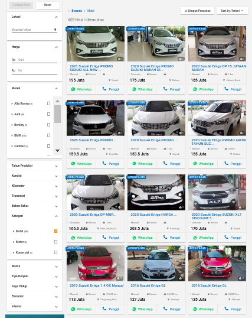

```{r setup, include=FALSE}
setwd("~/Documents/ikanx101/_posts/web scraping")
knitr::opts_chunk$set(echo = TRUE)
rm(list=ls())
library(dplyr)
```

_Web scraping_ adalah proses pengambilan data atau informasi dari internet. Sebagaimana kita ketahui bersama, semua yang ada di internet bisa dengan `mudah`-nya kita ambil (tentu dengan teknik yang tepat _yah_).

Berdasarkan pengalaman saya selama ini, ada beberapa teknik _web scraping_ yang bisa dilakukan. Yakni:

1. _Parsing html_ dengan cara __membaca__ _page source_ `.html` dari situs yang dituju.
    1. Kelebihan:
        1. Proses relatif cepat (walau tergantung koneksi juga).
        1. Bisa untuk kebanyakan situs, seperti: wikipedia, portal berita, blog, dst.
    1. Kelemahan:
        1. Harus menentukan target `css` dari situs terlebih dahulu.
        1. Untuk beberapa situs, proses mencari objek `css` bisa jadi menyulitkan.
        1. Tidak bisa digunakan untuk situs dinamis yang menggunakan `javascript`.
        1. Untuk situs yang menggunakan _login_, prosesnya agak rumit. 
1. _Mimicking browser_ dengan cara membuat _bot_ yang seolah-olah membuka _browser_ tertentu dan berinteraksi seperti layaknya manusia.
    1. Kelebihan:
        1. Bisa untuk (hampir) semua situs. Termasuk _social media_ atau situs dengan _login_ yang memiliki beberapa _steps authetification_.
        1. Bisa mengambil situs dinamis atau mengandung `javascript`.
    1. Kelemahan:
        1. Proses relatif lambat. Karena bertindak seolah-olah layaknya manusia membuka _browser_.
        1. Secara _coding_ lebih rumit karena harus membuat dua bagian algoritma: algoritma _mimick_ dan algoritma _scraper_ `css`.
1. Mengambil data menggunakan __API__.
    1. Kelebihan:
        1. Lebih mudah dan relatif cepat.
    1. Kelemahan:
        1. Proses mendapatkan __API__ kadang cukup rumit. Kadang didapatkan dengan cara mendaftar _as developer_ seperti di _Twitter_ atau mencari sendiri saat `inspect` __network__.
        1. Biasanya data hasil _scrape_ memiliki format `.json` yang jarang dikenal orang awam.
        
---

# _Libraries_ __R__ yang Digunakan

Setidaknya ada beberapa _libraries_ yang saya gunakan untuk ketiga teknik di atas:

1. _Parsing html_: `rvest` atau `ralger`.
1. _Mimicking browser_: `RSelenium`.
1. __API__: `jsonlite` untuk membaca _file_ `.json`.

Kali ini saya akan membahas teknik pertama dan ketiga. Selamat membaca dan mecoba _yah_.

---

# Tutorial _Parsing html_ 

Sekarang saya akan menunjukkan satu teknik yang sering saya gunakan untuk _web scrape_, yakni _parsing html_ menggunakan `library(ralger)`.

Kenapa menggunakan `ralger`?

> Jujur, saya lebih suka dan lebih sering menggunakan `library(rvest)`. Tapi `ralger` menawarkan kemudahan dan kepraktisan yang lebih baik bagi _scraper_ pemula yang masih belum paham mengenai `.css` _object_.

Untuk kasus yang rumit seperti _webscraping_ halaman _marketplace_ tidak akan saya bahas di sini _ya_. 

## _Scrape_ Isi _Body_ Halaman

Sebagai contoh, saya akan mencoba untuk _scrape_ berita di situs [Detikcom](https://www.detik.com/) terkait gempa.

Berikut [_link_](https://news.detik.com/berita/d-5344336/tni-ad-kirim-3-kapal-angkut-bantuan-untuk-korban-bencana-alam-kalsel-sulbar?_ga=2.212703508.1474967536.1611281806-371647059.1593093917) yang digunakan.

```{r}
url = "https://news.detik.com/berita/d-5344336/tni-ad-kirim-3-kapal-angkut-bantuan-untuk-korban-bencana-alam-kalsel-sulbar?_ga=2.212703508.1474967536.1611281806-371647059.1593093917"
```

Sekarang bagaimana melakukannya?

```{r,message=FALSE,warning=FALSE}
library(ralger)
judul = titles_scrap(url)
judul
```

Ternyata tidak hanya judul beritanya saja yang terambil tapi beberapa judul _headlines_ berita lain yang terambil. Kelak saya hanya akan mengambil _first entry_ saja.

```{r,message=FALSE,warning=FALSE}
body = paragraphs_scrap(url)
body
```

Jika dirapikan, maka akan kita dapatkan hasil seperti ini:

```{r}
judul = trimws(judul[1])
body = paste(trimws(body),collapse = "\n")
cat(judul,body)
```

## _Scrape_ Tabel dari _Body_ Halaman

Salah satu jenis data yang paling sering dicari di internet adalah data bentuk tabel. Data bentuk seperti ini adalah data yang paling mudah di-_scrape_.

> Lebih mudah dibandingkan dengan _copy_ dari _browser_ dan _paste_ ke dalam `excel sheet`.

Sebagai contoh saya akan _scrape_ data kecelakaan pesawat pada tahun 2021 yang disajikan di situs [_aviation-safety.net_](https://aviation-safety.net/wikibase/dblist.php?Year=2021)

Bagaimana caranya?

```{r}
url = "https://aviation-safety.net/wikibase/dblist.php?Year=2021"
tabel_hasil = table_scrap(url)
```

Karena datanya cukup banyak (`100` baris per 22 Januari 2020 16:18 WIB), saya akan tampilkan top 10 data teratas saja.

```{r,include=FALSE}
tabel_hasil = tabel_hasil %>% select(is.character)
```

```{r}
knitr::kable(head(tabel_hasil))
```


## _Scrape_ `css` Object dari Halaman

Sekarang adalah bagian paling asik saat melakukan _web scraping_, yakni mengambil data yang _scattered_ di dalam suatu _webpage_.

Sebagai contoh saya hendak mengambil data dari situs jual beli mobil [__Carmudi__](https://www.carmudi.co.id/).

Perhatikan _screenshot_ dari salah satu [_page_](https://www.carmudi.co.id/2020-suzuki-ertiga-dp-murah-angsuran-murah-1916271.html) berikut ini:

```{r,echo=FALSE,fig.align='center'}

```

Sekarang saya hendak mengambil informasi seperti:

1. Merek mobil (judul).
2. Harga mobil.
3. Informasi lain seperti: kilometer, transmisi, bahan bakar, dan kapasitas mesin.

Untuk mendapatkannya, saya perlu mencari tahu dulu letak `css` _object_ dari informasi-informasi tersebut. Untuk itu, saya menggunakan _chrome extension_ bernama __SelectorGadget__.

Setelah mengetahuinya, berikut langkah di __R__-nya:

```{r}
url = "https://www.carmudi.co.id/2020-suzuki-ertiga-dp-murah-angsuran-murah-1916271.html"
scrap(url,".c-listing-price")
scrap(url,".truncated")
scrap(url,".justify-content-center .font-weight-bold")
```

Dari data-data di atas, saya tinggal merapikannya saja ke dalam bentuk tabel yang rapih sebagai berikut:

```{r}
harga = scrap(url,".c-listing-price")[1]
judul = scrap(url,".truncated")[1]
kilometer = scrap(url,".justify-content-center .font-weight-bold")[1]
transmisi = scrap(url,".justify-content-center .font-weight-bold")[2]
bbm = scrap(url,".justify-content-center .font-weight-bold")[3]
cc = scrap(url,".justify-content-center .font-weight-bold")[4]
hasil = data.frame(judul,harga,transmisi,cc,bbm,kilometer)

knitr::kable(hasil)
```

Contoh di atas adalah saat saya _scrape_ dari _page_ yang menampilkan satu _listing_ mobil saja. 

Bagaimana jika saya ingin _scrape_ informasi harga mobil dari [halaman](https://www.carmudi.co.id/cars/suzuki/ertiga/) berikut ini?

```{r,echo=FALSE,fig.align='center'}

```

`library(ralger)` menawarkan satu cara lain yang simpel untuk _scraping_ informasi _scattered_ dari satu _page_ dan langsung menjadikannya dalam bentuk tabel. Yakni dengan _function_ `tidy_scrap()`.

Contoh:

```{r}
url_new = "https://www.carmudi.co.id/cars/suzuki/ertiga/"

hasil = 
  tidy_scrap(url_new,
             c(".item-title",".price",".icon-gearshift+ span",".catalog-listing-item-location span"),
             c("judul","harga","transmisi","lokasi"))

knitr::kable(hasil)
```

---

# Tutorial _Web Scraping_ dengan Memanfaatkan __API__

Sekarang saya akan memberikan satu contoh bagaimana kita melakukan web_ scraping_ menggunakan __API__ yang tersedia di situs yang hendak kita _scrape_.

Sebagai contoh, saya akan _scrape_ terjemahan dari Quran Surat Alfatihah yang tersedia di situs [Kementrian Agama](https://quran.kemenag.go.id/sura/1).

Untuk mengambil terjemah dan tulisan arabnya, kita bisa mengecek keberadaan __API__ dari situs tersebut dengan cara melakukan _inspect source_ di _tab_ `network`.

Setelah itu, kita hanya __tinggal__ membaca `.json` dari __API__ tersebut.

```{r}
url_new = "https://quran.kemenag.go.id/sura/1"

library(jsonlite)
data = read_json("https://quran.kemenag.go.id/api/v1/ayatweb/1/0/0/10")
str(data)
```

Sekarang tinggal merapikan hasilnya saja sebagai berikut:

```{r,echo=FALSE}
for(i in 1:7){
  cat(paste(data$data[[i]]$aya_text,collapse = "\n"))
}

for(i in 1:7){
  cat(paste(data$data[[i]]$translation_aya_text,collapse = "\n"))
}
```

---

# _Summary_

_Web scraping_ sebenarnya bukan perkara yang terlalu sulit. Justru saya lebih sering mendapatkan tantangan saat merapikan data hasil _scraping_ tersebut.

---

`if you like this article, please support by clicking the ads, thanks.`