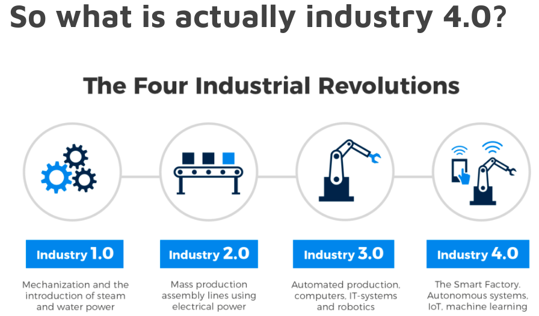
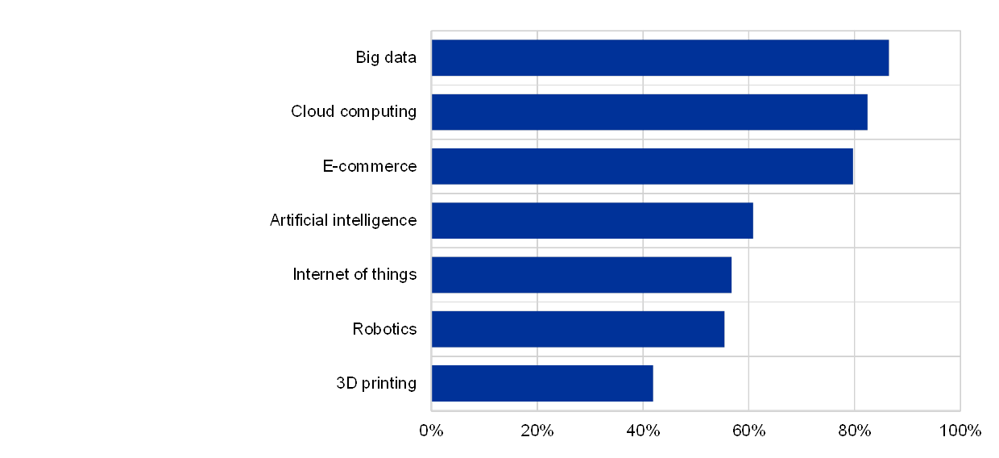
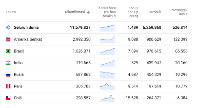

```{r setup, include=FALSE}
knitr::opts_chunk$set(echo = TRUE)
setwd("~/Documents/ikanx101.com/_posts/webinar/pertanyaan webinar")
```

Apakah anda pernah mendengar jargon __Industry 4.0__?

```{r out.width="70%",echo=FALSE,fig.align='center'}

```

---

Perlu saya informasikan, sebenarnya jargon ini tidak harus berjalan berurutan. Maksudnya apa?

> Dalam sebuah negara, bisa jadi dua atau lebih versi industri ini berjalan bersamaan.

Contoh: manufaktur di India masih berjalan di `2.0` sedangkan _aerospace_-nya sudah `4.0`.

---

Berdasarkan studi yang dilakukan di [Eropa](https://www.ecb.europa.eu/pub/economic-bulletin/focus/2018/html/ecb.ebbox201807_04.en.html), efek dari perkembangan teknologi digital dan digitalisasi bagi perusahaan adalah sebagai berikut:

```{r out.width="70%",echo=FALSE,fig.align='center'}

```

Kalau direnungkan dengan perlahan, mulai dari `big data` sampai `internet of things` itu erat kaitannya dengan data.

Banyak dari kita yang belum sadar bahwa muara dari digitalisasi ini adalah banyaknya _captured data_. Saking banyaknya, hampir setiap detik kita bisa memproduksi data dari _gadget_ kita masing-masing. Selain itu data yang muncul __bukan lagi berupa tabel angka!__ 

> Postingan yang Anda lakukan di Instagram juga bisa disebut data!

Pada tahun 2006, Profesor Thomas Davenport dalam artikel di [HBR](https://hbr.org/2006/01/competing-on-analytics
) menyebutkan bahwa:

> Every companies can sell same products, can provide same services.

Lalu apa pembedanya?

Pembedanya adalah __Analytics!__ Yaitu kemampuan perusahaan untuk bisa mengeksplorasi dan mengeksploitasi data yang ada di internal dan eksternal organisasinya.

Oleh karena itu, kondisi sekarang menjadi semakin rumit. _Tools_ tradisional semacam __Ms. Excel__ sudah tidak mampu mengolah data yang bentuk dan strukturnya makin lama makin aneh yang datang semakin cepat dan banyak serta dengan tujuan dan metode analisa yang lebih _advance_.

---

### This leads us to a new job titles:

1. _Data engineer_: _A Data Engineer is a person who specializes in preparing data for analytical usage._
1. _Data analyst_: _A data analyst in a person who extract  information from a given pool of data._
1. _Data scientist_: _A data scientist is a person who possess knowledge of statistical tools and programming skills. Moreover, a data scientist possesses knowledge of machine learning algorithms._

### Masih bingung?

Saya kasih contoh data Covid 19 yang tersedia di situs [World o Meters](https://www.worldometers.info/coronavirus/).

```{r out.width="40%",echo=FALSE,fig.align='center'}

```

Seorang __data engineer__ bertugas untuk menyiapkan _platform_ penyimpanan data (_cloud_ atau _on premise_), memikirkan bagaimana struktur data yang akan disimpan, dan menyiapkan data untuk bisa dianalisa lebih lanjut. Oleh karena itu dia harus memiliki _knowledge_ lebih terkait _data warehouse_.

Seorang __data analyst__ bertugas untuk memberikan narasi dan analisa deskripsi dari data. Oleh karena itu dia harus memiliki _basic knowledge_ terkait statistik dan _business process_.

Seorang __data scientist__ bertugas untuk membuat model matematika atau statistik untuk melakukan prediksi atau _deep dive analysis_ dari data. Oleh karena itu dia harus memiliki knowledge terkait _machine learning_ dan _advance algorithms_.

---

### Kenapa hal ini menjadi penting?

Biasanya saya selalu menginformasikan hal ini setiap kali hendak memberikan _training_ seputar data. Faedahnya adalah agar _trainee_ bisa menentukan ekspektasi mereka sendiri seperti apa. _Roles_ mana yang ia akan lakukan di fungsi pekerjaannya sehari-hari.

Namun, untuk beberapa orang yang bekerja di _environment_ yang kecil, bisa jadi ketiga _roles_ di atas dikerjakan oleh __satu orang__ saja. Implikasinya apa? Orang tersebut minimal harus mengerti [struktur data](https://ikanx101.com/blog/mengenal-data/), mau disimpan di mana dan dengan cara seperti apa sampai nanti akan dianalisa seperti apa.