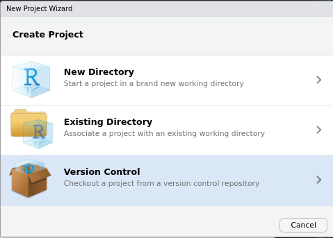

```{r setup, include=FALSE}
knitr::opts_chunk$set(echo = TRUE)
setwd("~/Documents/ikanx101.com/_posts/work at github")
rm(list=ls())
```

Pandemi COVID-19 yang melanda dunia ini sedikit banyak mengubah tatanan dunia kerja menuju lebih digital. Beruntung bagi saya, perusahaan tempat saya bekerja sudah lebih dulu mengusung tema `digital` dan `remote working`. Isu mengenai impelementasi _WFH_ sudah selesai dibahas bahkan sejak saya pertama kali kerja di sana (tahun 2012).

Jadi _WFH_ sekarang ini bukanlah barang baru bagi kami.

> _Concerns_ mengenai cara kerja dan produktivitas sudah _case closed_!

Sebagai seorang yang bekerja _rely on data and analytics_, sebenarnya saya cukup membutuhkan laptop atau komputer saja. Kebetulan juga saya selalu mengerjakan setiap _project data science_ sendirian, jadi koordinasi yang dilakukan biasanya memang langsung ke klien internal kantor saja. Tidak perlu repot-repot mengurusi administrasi apa-apa.

---

Untuk urusan laptop, saya sudah pernah menulis mengenai [Ubuntu](https://ikanx101.com/blog/review-ubuntu/) dan [ChromeOS](https://ikanx101.com/blog/laptop-chromium/). Jadi sebenarnya _gak_ masalah mau pakai OS apa saja, yang penting __R Studio__ harus bisa digunakan di __OS__ tersebut. Namun, sekarang saya lebih memilih Ubuntu sebagai _daily driver_ saya.

_Nah_, setelah mulai _WFH_, timbul beberapa masalah baru:

1. Saya menggunakan `2` laptop untuk bekerja, oleh karena itu saya membutuhkan satu media penyimpanan _files_ yang bisa digunakan untuk memindah-mindahkan _files_ dari satu laptop ke laptop lainnya. Awalnya saya menggunakan _USB drive_ untuk melakukan hal tersebut. Tapi kadang saya jadi _keder_ sendiri. Puncaknya adalah saat saya lupa _file_ mana yang memiliki _version_ terbaru. Akibatnya pekerjaan saya hilang karena tertimpa dengan file yang lebih rendah _version_-nya.
1. Saya dan beberapa rekan kantor menginisiasi _training_ __R__, oleh karena itu kadang-kadang diperlukan media untuk bisa mengkolaborasikan _script_ dan materi _training_ dengan efisien antar _trainer_ dan _trainee_.

Jadi muncul kebutuhan akan satu media yang bisa diandalkan untuk memindahkan _files_ dan memudahkan kolaborasi. Media _cloud_ seperti _One Drive_ atau _Google Drive_ menurut saya kurang tepat digunakan untuk bekerja dengan _R Studio_.

> Berhubung saya sudah menggunakan _Github_ sebagai _back bone_ membuat situs ini, maka kenapa tidak saya maksimalkan saja untuk urusan kerjaan? 

Begitu pikir saya.

---

### Bagaimana menyambungkan Github ke R Studio?

Saya membuat beberapa _repository_ yang kemudian saya hubungkan ke _R Studio_. Bagaimana caranya?

#### Pertama

Buat dulu _repository_ di _Github_, lalu cari bagian _code_, _copy_ alamat yang tertera pada _section_ `https` tersebut.

```{r,echo=FALSE,fig.align='center'}

```

#### Kedua

Buka _R Studio_, pilih `File` -> `New Project` -> `Version Control` -> `Git`. _Paste_ alamat dari github ke kolom yang ada.

```{r,echo=FALSE,fig.align='center'}



```

#### Ketiga

_R Studio_ secara otomatis melakukan _cloning_ _folders_ dan _files_ dari _Github_ ke _local disk_. Sekarang kita bisa memodifikasi semua _file_ tersebut secara _offline_. Saat nanti ada perubahan (penambahan, pengurangan, atau modifikasi), kita bisa _synchronize_ dengan melakukan _commit_, _push_, dan _pull_ dari _R Studio_.

---

### Jadi apa saja yang saya lakukan dalam memaksimalkan Github saat _WFH_?

#### 1. Membuat _public repository_ untuk wadah _training_

Hal yang pertama kali saya lakukan adalah membuat _public repository_ untuk wadah _training R_ di kantor. Kemudian saya menghubungkan _repository_ tersebut ke _R Studio_. Jadi setiap _script_ yang saya _share_ dan tunjukkan kepada _trainee_ bisa diakses _real time_.

#### 2. Membuat _private repository_ untuk _daily jobs_

Seperti yang saya kemukakan sebelumnya, bekerja dengan `2` laptop membutuhkan satu manajemen _files_ yang mumpuni dan _gak bikin bingung_. Dengan membuat _private repository_ (supaya tidak ada yang bisa _ngintip_), saya bisa menyimpan _files_ kerjaan di satu tempat saja.